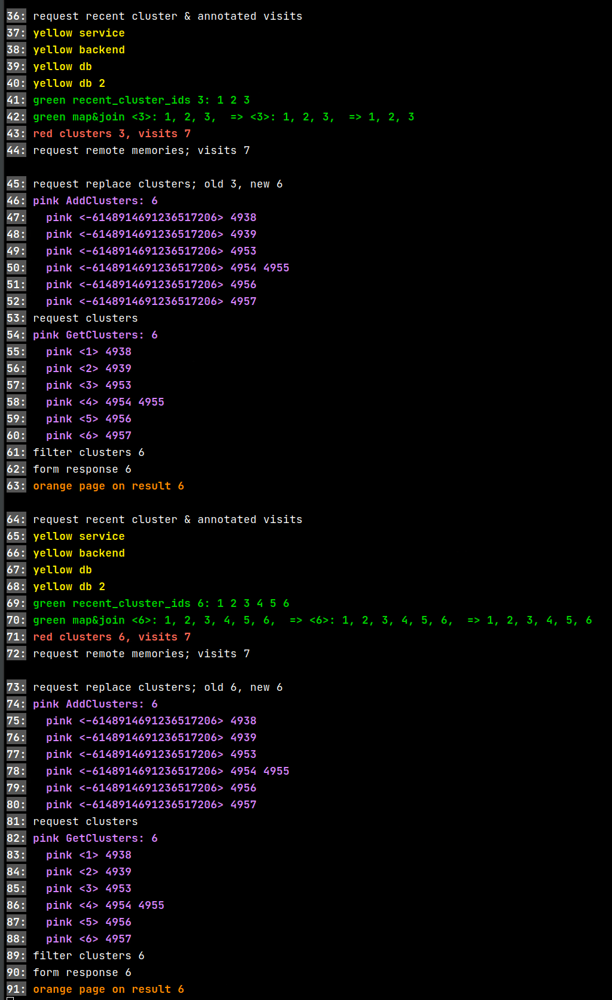

# cfinch

Generate command line arguments for running chromium with finch configurations.

## Common examples

#### Configuring features & params:

```
cfinch \
  -f myFeature1 myFeature2 \
  -p myParam1 paramValue1 myParam2 paramValue2
```

Will generate

```
out/Default/chrome\
  --force-fieldtrials=OmniboxBundledExperimentV1/Default\
  --enable-features='myFeature1<OmniboxBundledExperimentV1,myFeature2<OmniboxBundledExperimentV1'\
  --force-fieldtrial-params=OmniboxBundledExperimentV1.Default:myParam1/paramValue1/myParam2/paramValue2
```

#### Configuring study & group:

```
cfinch -c stable -s myStudy -g myGroup
```

Will generate

```
out/Default/chrome\
  --fake-variations-channel=stable\
  --variations-server-url=http://localhost:8080/seed\
  --force-fieldtrials=myStudy/myGroup
```

## Chromium params supported

1. `fake-variations-channel`
1. `variations-server-url`
1. `force-fieldtrials`
1. `enable-features`
1. `force-fieldtrial`
1. `force-variation-ids`
1. `google-base-url`

## Usage

1. Clone this repo & run `npm i`
1. Add an alias `cfinch` to `<path>/chromeFinch/bin/cfinch.js "$@"`
1. Update `<path>/chromeFinch/paths.json` if necessary.
    - By default, `~/workspace/chromium/src` and `~/workspace/depot_tools/ninja` will be used for the chrome src and ninja paths.
1. Run `cfinch help` to print:

```
> cfinch help
Arguments:
    -o out/Default                                              out|o         single string       overrides the default build dir "out/Default"
    -b                                                          build|b       no values           rebuilds.
    -c beta                                                     channel|c     single string       sets fake-variations-channel=beta and variations-server-url=http://localhost:8080/seed
    -d                                                          dogfood|d     no values           sets variations-server-url=http://localhost:8080/seed?restrict=dogfood
    -s OmniboxBundledExperimentV1                               study|s       single string       overrides the default study "OmniboxBundledExperimentV1" used below
    -g Dev_Desktop_OmniboxDocumentMinCharacters_Control_V2      group|g       single string       sets force-fieldtrials=study/group
    -f OmniboxLocalEntitySuggestions ...                        feature|f     multiple strings    sets enable-features="OmniboxLocalEntitySuggestions,...<study
    -p UIMaxAutocompleteMatches 8 OmniboxMaxURLMatches 4 ...    param|p       multiple strings    sets force-fieldtrial-params=study.group:UIMaxAutocompleteMatches/8/OmniboxMaxURLMatches/4/...
    -gi t3315884 3314219 ...                                    gwsid|gi      multiple strings    sets force-variation-ids="t3315884,3314219,..."
    -gbu https://manukh-4.demos.corp.google.com/                google|gbu    single string       sets google-base-url=https://manukh-4.demos.corp.google.com/
```

# ctest

Like `cfinch`, but for running chromium tests.

```
ctest -f MemoriesServiceTest.*
```

Will generate

```
out/Default/components_unittests --gtest_filter=MemoriesServiceTest.*
```

```
> cTest help
Arguments:
    -o out/Default              out|o       single string    overrides the default build dir "out/Default"
    -b                          build|b     no values        rebuilds.
    -s components_unittests     set|s       single string    overrides the default test set "components_unittest"
    -f MemoriesServiceTest.*    filter|f    single string    sets gtest_filter=filter
```

# Idea IDE integration

The `ctest_ide.js` and `cfinch_study_ide.js` scripts are meant to make the above easier to use with Idea IDEs.

## ctest_ide

In your Idea IDE, configure an 'external tool' with:
```
Program:   <...>/node/<version>/bin/node
Arguments: <...>/chromeFinch/bin/ctest_ide out/Default $FilePath$
```

Navigate to e.g. `memories_service_unittest.cc` and invoke the external tool. The script will build chromium and run `out/Default/components_unittests --gtest_filter=MemoriesServiceTest.*`.
Supports `unit_tests`, `components_unittests`, and `views_unittests`.

## cfinch_study_ide

In your Idea IDE, configure an 'external tool' with:
```
Program:   <...>/node/<version>/bin/node
Arguments: <...>/chromeFinch/bin/cfinch_study_ide out/Default $FilePath$ $SelectedText$
```

Navigate to a `.gcl` study file, select a group name, and invoke the external tool. The script will run e.g.:
```
out/Default/chrome\
  --fake-variations-channel=dev\
  --variations-server-url=http://localhost:8080/seed\
  --force-fieldtrials=<study_name>/Dev_Desktop_OmniboxEntityLatency_SharedDecoder_V2
```

# Output formatting

To make reading output easier, all above scripts will be slightly modified according to these rules:

- Replace file paths with idea IDE compatible paths.
- Color & style output; see supported styles below
  - E.g. `println('underline red x blue y bold z\n');` will print `underline red x blue y bold z` styled accordingly.
- Prefix lines with line numbers
- Print a new line when output is delayed more than 1.5s; this helps group up long outputs.
- Hide outputs matching `/^[/\w.]+\/gomacc .*$/`.



## Supported styles

Misc

- normal
- bold
- underline

Colors

- black
- red
- green
- yellow
- blue
- pink
- cyan
- white
- orange
- gray

Inverted colors

- iblack
- ired
- igreen
- iyellow
- iblue
- ipink
- icyan
- iwhite
- iorange
- igray

Inverted light colors

- ilblack
- ilred
- ilgreen
- ilyellow
- ilblue
- ilpink
- ilcyan
- ilwhite
